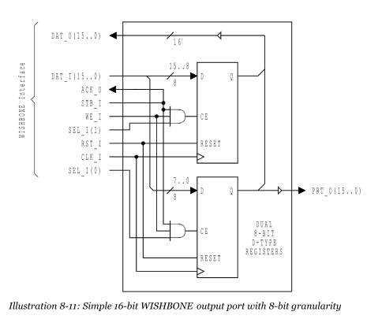
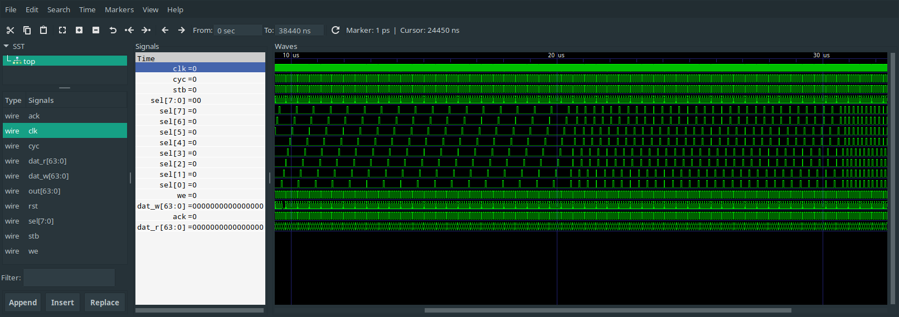

# nMigen WISHBONE Examples
The code in this repository is based on Chapter [8. Appendix A – WISHBONE Tutorial](https://cdn.opencores.org/downloads/wbspec_b4.pdf#page=91).

## Getting Started

Run this once to clone the repository and setup the environment.
```bash
git clone https://github.com/cyber-murmel/nmigen-wishbone-examples.git
# create and enter virtual environment
python3 -m venv .venv
source .venv/bin/activate
# install dependencies in virtual env
pip install --upgrade pip
pip install -r requirements.txt
# we want the newes nmigen
pip install --use-feature=2020-resolver 'git+https://github.com/nmigen/nmigen.git@master#egg=nmigen'
```
You have to enter the repository and run `source .venv/bin/activate` everytime you open a new shell, if you want to the scripts.

## Chapters

### 8.6 Output Port


The document gives and example for an output port with 16bit width and 8bit granularity.
Python and nMigen allow us to make the interface and logic of module parameterizable.
The module implemented in [output_port.py](output_port/output_port.py) is an output port with parametric width and granularity.
A simple test is run when the module gets executed.

#### Usage
When the python module is run, it instatiates a `OuputPort` and performs as simple test loop.
Width and granularity of the bus can be configured via command line arguments.
The test is run for all possible aligned granularities. The number of loops to run for each can be configured.
Waveforms are written to a file for inspection.

```
$ python -m output_port -h
usage: __main__.py [-h] [-q | -v] [--vcd VCD] [--gtkw GTKW] [--width {8,16,32,64}] [--granularity {8,16,32,64}] [--loop LOOP]

Python CLI Template

optional arguments:
  -h, --help            show this help message and exit
  -q, --quiet           turn off warnings
  -v, --verbose         set verbose loglevel
  --vcd VCD             path to vcd file
  --gtkw GTKW           path to gtkw file
  --width {8,16,32,64}  bus data width
  --granularity {8,16,32,64}
                        bus data granularity
  --loop LOOP           number of test loops to run

$ python -m output_port -v --width 64 --granularity 8
2020-11-06 11:15:01 INFO     All tests passed!
2020-11-06 11:15:01 INFO     Run `gtkwave /tmp/traces.gtkw` to inspect wave forms

$ gtkwave /tmp/traces.gtkw
```


