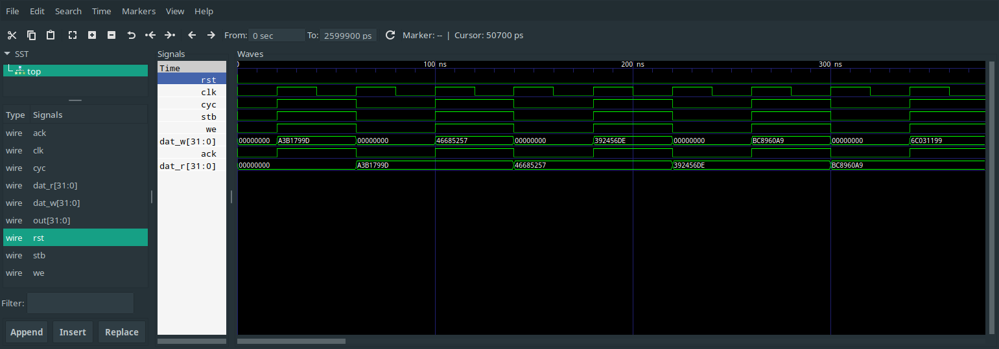

# nMigen WISHBONE Examples
The code in this repository is based in Chapter [8. Appendix A – WISHBONE Tutorial](https://cdn.opencores.org/downloads/wbspec_b4.pdf#page=91).

## Getting Started

Run this once to clone the repository and setup the environment.
```bash
git clone https://github.com/cyber-murmel/nmigen-wishbone-examples.git
# create and enter virtual environment
python3 -m venv .venv
source .venv/bin/activate
# install dependencies in virtual env
pip install --upgrade pip
pip install -r requirements.txt
# we want the newes nmigen
pip install --use-feature=2020-resolver 'git+https://github.com/nmigen/nmigen.git@master#egg=nmigen'
```
You have to enter the repository and run `source .venv/bin/activate` each time you open a new shell, if you want to the scripts.

## Chapters

### 8.6.1 Simple Output Port


This module is implemented in [simple_output_port.py](port/simple_output_port.py).

#### Usage
If the python module is run, it instatiates a `SimpleOuputPort` with the given width (default 8) and performs as simple test loop. The waveforms are written do a file for inspection.

```bash
$ python -m port -h
usage: __main__.py [-h] [-q | -v] [--vcd VCD] [--gtkw GTKW] [--width {8,16,32,64}] [--loop LOOP]

Python CLI Template

optional arguments:
  -h, --help            show this help message and exit
  -q, --quiet           turn off warnings
  -v, --verbose         set verbose loglevel
  --vcd VCD             path to vcd file
  --gtkw GTKW           path to gtkw file
  --width {8,16,32,64}  bus data width
  --loop LOOP           number of test loops to run
  ```

Run `python -m port -v`
```
2020-11-06 01:51:22 INFO     All tests passed!
2020-11-06 01:51:22 INFO     Run `gtkwave /tmp/traces.gtkw` to inspect wave forms
```

`gtkwave /tmp/traces.gtkw`
